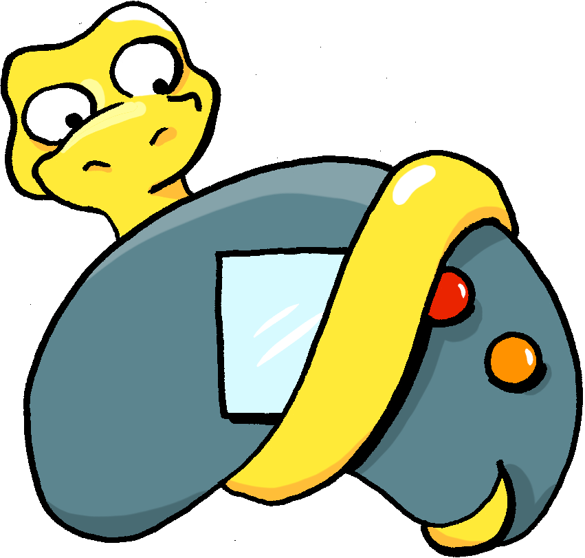

# Pygame-Buddy
The Pygame-Buddy interface aims to turn a Raspberry-Pi into an educational gaming console. Based on Python and Pygame, it allows the player (or coder) to enjoy the games created by others, modify them or program new games!

- Flash it on your Raspberry-Pi
- plug a GamePad Controller
- connect the whole thing to your TV
- load games through a USB drive
- and you're ready to go! 

The whole user interface is made with pygame.

Credits for the graphics: Valentina Pantaleoni.
